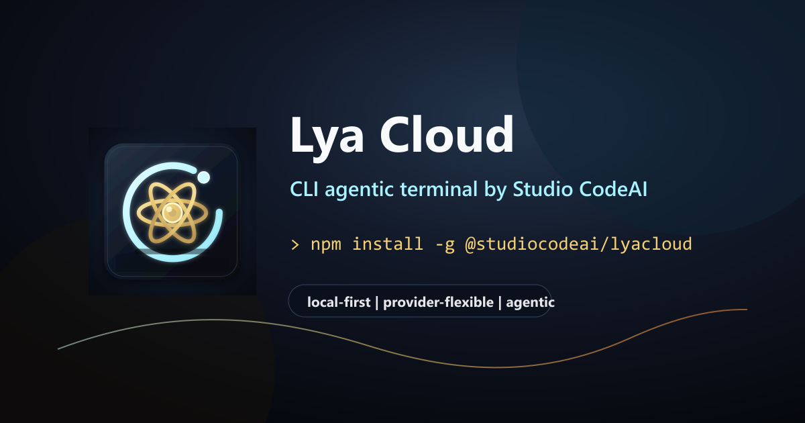

# Lya Cloud

**CLI agentic terminal by Studio CodeAI.**



Lya Cloud é uma CLI agentic para desenvolvimento de software. A proposta é abrir um projeto real no terminal e trabalhar com uma IA capaz de ler código, editar arquivos, executar comandos, usar ferramentas, alternar provedores de modelo e apoiar tarefas de engenharia.

Este projeto faz parte da família **Studio CodeAI** e nasce como a **CLI Star 1** do ecossistema: a camada terminal agentic que serve a irmã mais velha, [Lya Studio Coder](https://github.com/StudioCodeAI/Lya-Studio-Coder).

## Status

Lya Cloud está em fase de fundação.

O repositório atual é privado e ainda não deve ser tratado como release público, pacote npm oficial ou projeto open source final. A prioridade agora é consolidar identidade, build, instalação local, provedores, segurança e licenciamento.

## Linhagem do Projeto

O projeto anterior em `StudioCodeAI/LyaCode` foi descontinuado. Sua evolução oficial migrou para **Lya Cloud**, o novo terminal CLI agentic da família Studio CodeAI.

LyaCode permanece como referência histórica e visual. Lya Cloud é a linha de produto atual, a base deste repositório e o caminho de lançamento.

## Papel no Ecossistema Studio CodeAI

Lya Studio Coder é o cockpit/IDE maior da família Studio CodeAI. Lya Cloud é a camada CLI: mais leve, terminal-first, instalável em projetos reais e preparada para executar tarefas agentic diretamente no workspace.

Em termos de produto:

- **Lya Studio Coder**: experiência visual completa, cockpit multi-IA, editor, automações e orquestração.
- **Lya Cloud**: CLI Star 1, terminal agentic, base de execução local/cloud e ponte operacional para projetos de código.

O objetivo é que Lya Cloud possa funcionar sozinha no terminal e também servir como fundação CLI para fluxos do Lya Studio Coder.

## O Que Já Existe

- CLI em TypeScript com runtime Node.js.
- Interface terminal com React/Ink.
- Ferramentas de leitura, busca, edição e inspeção de arquivos.
- Execução de shell/PowerShell com fluxo de permissão.
- Perfis de provedores locais e cloud.
- Suporte a rotas OpenAI-compatible, Ollama, Gemini, Codex e provedores Anthropic-family.
- MCP, agentes, tarefas, memória, workflow e sessões.
- Extensão VS Code em `vscode-extension/lyacloud-vscode`.
- Site/documentação em `web/`.
- Identidade visual própria do Lya Cloud em `assets/brand/`.

## Requisitos

- Node.js `>=22.0.0`
- Bun `>=1.3.13`
- Git
- ripgrep recomendado para melhor busca em projetos

## Instalar Dependências

Na raiz do projeto:

```bash
bun install
```

Para o site:

```bash
bun install --cwd web
```

## Rodar em Desenvolvimento

Build da CLI:

```bash
bun run build
```

Executar a CLI pela raiz:

```bash
node bin/lyacloud
```

Verificar versão:

```bash
node bin/lyacloud --version
```

Resultado esperado:

```text
0.1.0 (Lya Cloud)
```

## Instalar Como Pacote Local

Gerar pacote local:

```bash
npm pack
```

Instalar globalmente a partir do pacote gerado:

```bash
npm install -g ./studiocodeai-lyacloud-0.1.0.tgz
```

Testar:

```bash
lyacloud --version
lyacloud
```

Remover depois do teste:

```bash
npm uninstall -g @studiocodeai/lyacloud
```

## Comandos de Validação

CLI:

```bash
bun run smoke
bun run typecheck
bun test
```

Site:

```bash
bun run web:build
bun run web:typecheck
```

Extensão VS Code:

```bash
cd vscode-extension/lyacloud-vscode
bun install
bun test src
```

## Provedores

Dentro da CLI:

```text
/provider
```

Exemplo com Ollama via rota OpenAI-compatible no PowerShell:

```powershell
$env:CLAUDE_CODE_USE_OPENAI="1"
$env:OPENAI_BASE_URL="http://localhost:11434/v1"
$env:OPENAI_MODEL="qwen2.5-coder:7b"
$env:OPENAI_API_KEY="local"
node bin/lyacloud
```

Variáveis `CLAUDE_CODE_*` ainda podem aparecer por compatibilidade técnica com partes herdadas da base. Elas não são identidade de produto do Lya Cloud.

## Atalhos Windows

Aliases PowerShell:

```text
scripts/windows/lyacloud-aliases.ps1
```

Aliases documentados:

- `lc`
- `lya`
- `lyacloud-local`
- `lyacloud-provider`
- `lyacloud-help`

Guia:

```text
docs/windows-aliases-and-launchers.md
```

## Estrutura

```text
bin/                 launcher da CLI
src/                 código TypeScript
scripts/             build, validação, provedores e utilitários
docs/                documentação técnica e produto
web/                 site/documentação
vscode-extension/    extensão companion para VS Code
tests/               testes de SDK e build
python/              helpers legados/locais existentes
assets/brand/        identidade visual do Lya Cloud
```

## Identidade

Nome do produto:

```text
Lya Cloud
```

Pacote e comando:

```text
@studiocodeai/lyacloud
lyacloud
```

Configuração:

```text
.lyacloud
LYACLOUD_*
```

Identificadores de código:

```text
lyaCloud
LyaCloud
```

## Git e Segurança

Não commitar:

- `node_modules/`
- `dist/`
- `.env`
- chaves de API
- credenciais locais
- perfis locais de provedor
- `.lyacloud/`
- logs, relatórios e artefatos de build

Repositório remoto:

```text
https://github.com/StudioCodeAI/lyacloud
```

Por enquanto, manter como privado.

## Roadmap

Documentos principais:

```text
docs/LYA_CLOUD_ROADMAP.md
docs/LYA_IDENTITY.md
docs/BRAND_ASSETS.md
```

Próximas frentes:

- finalizar onboarding de provedores;
- definir integração e contratos com Lya Studio Coder;
- validar caminhos local e cloud;
- revisar segurança e permissões;
- preparar primeira release privada;
- criar página pública do produto;
- decidir estratégia de licença e distribuição;
- planejar se `lyacode` será alias, marca futura ou produto legado.

## Licença e Distribuição

Este projeto contém código derivado de uma base de coding-agent CLI herdada. A licença ainda está em revisão.

Não publicar como open source nem distribuir publicamente antes da revisão legal/técnica. As modificações da Studio CodeAI podem receber uma licença própria quando for seguro separar o que é nosso do que é herdado.

Não publicar secrets, termos privados de parceiros ou credenciais neste repositório.
